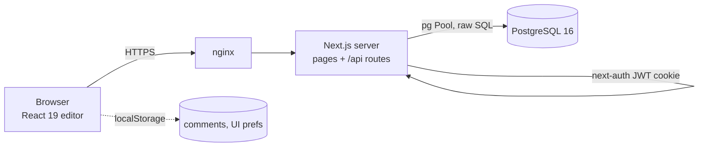
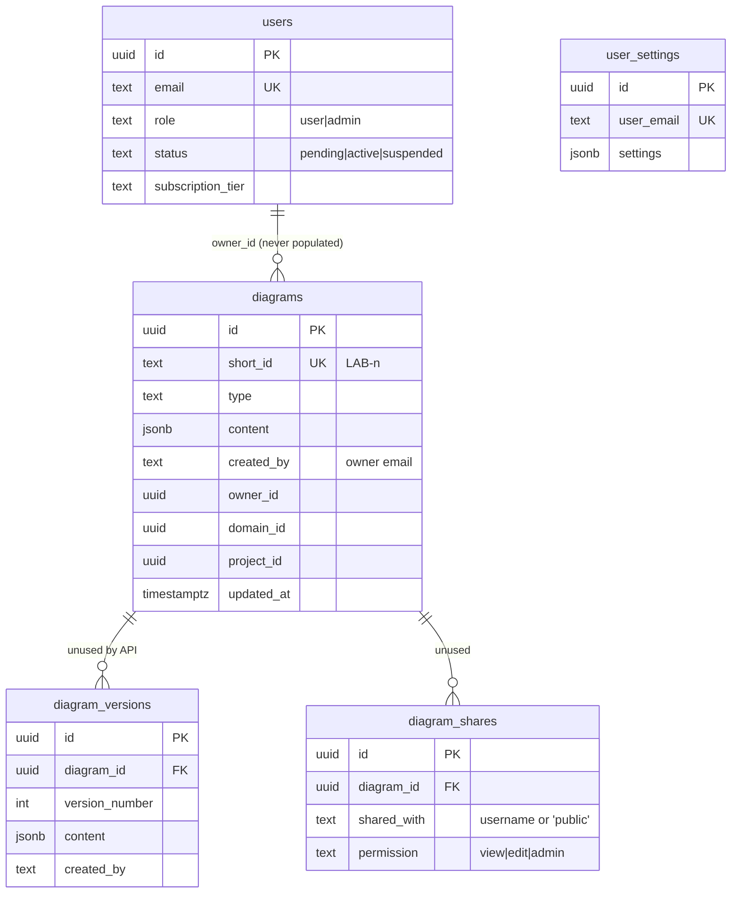

# Architecture — Ontographia Lab Diagram Studio

Status: **baseline (as-built, derived from code on `main` @ df9facb)** plus pointers to proposed designs. Slice 0 (save path, ids, migrations) has since shipped; its effects are marked *(slice 0)* below.
Proposed work is in the ADRs and companion docs below; nothing here is implemented until the matching slice in [delivery-plan.md](delivery-plan.md) ships.

| Doc | Purpose |
|-----|---------|
| [adr/0001-version-history.md](adr/0001-version-history.md) | Group B — versions: when created, restore, compare, storage |
| [adr/0002-comments.md](adr/0002-comments.md) | Group B — server-persisted, anchored comment threads |
| [adr/0003-sharing-and-permissions.md](adr/0003-sharing-and-permissions.md) | Group C — roles, grants, invitations, links, single authorization function, audit |
| [adr/0004-realtime-collaboration.md](adr/0004-realtime-collaboration.md) | Group D — decision record + prerequisites only |
| [data-model.md](data-model.md) | Proposed DDL, indexes, migration mechanism, retention |
| [api-contracts.md](api-contracts.md) | REST contracts for B and C, authorization signature, MCP tool sketch |
| [open-questions.md](open-questions.md) | Decisions that belong to the product owner, each with a recommended default |
| [delivery-plan.md](delivery-plan.md) | Ordered, independently shippable vertical slices |

## 1. System at a glance

Single Next.js 16 app (pages router, React 19), built as `output: 'standalone'`, run in Docker next to PostgreSQL 16; in production a single Node process sits behind nginx at `lab.ontographia.com`.



| Layer | Where | Notes |
|-------|-------|-------|
| Pages | `pages/*.js`, `pages/diagram/[id].js` | Editor page loads the diagram, picks a profile by diagram type, renders `DiagramStudio` |
| Editor | `components/diagram-studio/` | `DiagramContext.js` owns elements/connections/layers/groups, local undo/redo and autosave; `DiagramCanvas.js` renders SVG; `DiagramProfile.js` defines profiles incl. `editingPolicy.readOnly` |
| Comments (client-only) | `components/diagram-studio/ui/CommentSystem.js` | `useComments(diagramId)` keeps threads in `localStorage['comments-<id>']`; not shared, not persisted server-side |
| API | `pages/api/diagrams/index.js`, `[id].js`, `api/user/settings.js`, `api/admin/users`, `api/auth/*` | Each handler calls `requireActiveUser` then does its own access check |
| Auth | `pages/api/auth/[...nextauth].js`, `lib/useAuth.js` | next-auth v4, JWT strategy (30 days); Credentials + Google + GitHub; `session` callback re-reads `role`, `status`, `subscription_tier` from `users` on every session read |
| Data access | `lib/db.js` (pool + ad-hoc startup migration), `lib/diagramRepository.js`, `lib/userSettingsRepository.js` | Raw SQL via `pg` |
| Tests | `__tests__/` | Jest (unit + puppeteer e2e projects) — note: the global default of Vitest does not apply to this repo |

## 2. Data model (as built, `init.sql`)



- **Content blob**: `diagrams.content` is one JSONB document `{ elements[], connections[], layers[], groups[], viewport }`. Legacy rows may use `nodes`/`edges` or the pre-slice-0 "double write" shape (a nested `diagram` copy, no `viewport`); `normalizeDiagramContent` (`components/diagram-studio/migrations/normalizeContent.js`) maps all of them to the canonical shape on read, and the next save rewrites the row canonically *(slice 0)*. New ids are `<prefix>-<uuid v4>` from `crypto.randomUUID()` via `components/diagram-studio/utils/ids.js` (`el-`, `conn-`, `layer-`, `group-`, `frame-`, `sticky-`, `drawing-`); existing ids (`el-<ms>-<rand>`, `el_<ms>_<idx>`, `frame_<ms>`) remain valid and are never rewritten *(slice 0)*.
- **Ownership** is effectively `diagrams.created_by = users.email`. `owner_id` exists but `createDiagram` never sets it.
- **Schema evolution** *(slice 0)*: `init.sql` is frozen and only bootstraps a fresh Docker volume. Every change is a forward-only file in `db/migrations/` applied by `scripts/migrate.js` (`npm run db:migrate`; also before `npm start` and in the container `CMD`), recorded in `schema_migrations` with a checksum. `0001_baseline` is idempotent and replaces the former `lib/db.js#runMigrations`; the app no longer migrates lazily.

## 3. Request flow (save)

```mermaid
sequenceDiagram
  participant C as DiagramContext
  participant P as pages/diagram/[id].js
  participant API as PUT /api/diagrams/[id]
  participant DB as PostgreSQL
  C->>C: edit → dirty → 1 s debounce
  C->>API: PUT {name, description, content}
  API->>API: requireActiveUser → checkAccess(created_by==email || admin)
  API->>DB: UPDATE diagrams SET content=… (COALESCE per field)
  API-->>C: row
  C->>P: onSaveCallback({elements,…,diagram})  (notification only; the page does not write)
```
Before slice 0 the page's `onSave` handler issued a second PUT with `{elements,…,diagram}`, nesting a full copy of the row at `content.diagram.content` and dropping `viewport`.

Authorization today: `requireActiveUser` (session + `status==='active'`) then `diagramRepository.checkAccess` → access iff `role==='admin'` or `created_by===email`. List (`GET /api/diagrams`) filters by `created_by` for non-admins and returns full rows including `content`.

## 4. Baseline observations that affect Groups B–D

1. ~~**Double write per save.**~~ **Fixed in slice 0.** `DiagramContext.saveDiagram` is the only writer; the editor page no longer passes a PUT-ing `onSave`. Rows written before the fix keep the nested copy until their next save; reads normalize them.
2. **Whole-blob last-write-wins.** No revision/precondition on PUT. Harmless with one editor; unsafe as soon as Group C allows a second editor (addressed in ADR-0003 §Concurrency).
3. **Ownership by email string.** Grants should key on `users.id`; `owner_id` needs a backfill (data-model.md, migration 0003).
4. **Authorization is per-route and binary.** Group C replaces it with one policy function (ADR-0003).
5. **Viewport is stored in shared content.** Fine single-user; with sharing/real-time it is per-viewer state (ADR-0004 prerequisites).
6. **List endpoint returns `content`.** Gets expensive as diagrams grow; the shared-with-me list in Group C should return metadata only.
7. **Undo/redo is client-local** and unrelated to server versions (ADR-0001 keeps them separate).

## 5. Design principles applied to B–D

- **Substrate, not template**: versions, comment threads, grants, links and audit events are generic primitives over any diagram type; no role-specific workflow (e.g. "review cycle") is baked in.
- **One authorization function** used by REST routes, the future socket server and the future MCP server.
- **Server owns history**: versions are created server-side so they work regardless of which client (web, socket, agent) wrote the content.
- **Shared content ≠ annotations ≠ access**: content blob, comment tables and grant tables are separate so each has its own permission and lifecycle.
