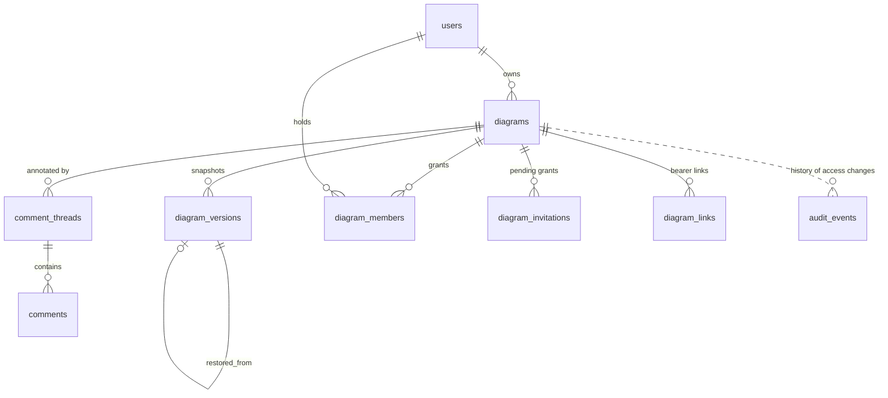

# Data model — proposed changes for Groups B and C

Status: **Proposed** (except §1 and `0001_baseline`, which shipped in slice 0 and are described as built). DDL below is design-level; exact column lengths may be adjusted at implementation. Each migration maps to a slice in [delivery-plan.md](delivery-plan.md).

## 1. Migration mechanism (minimal)

Today: `init.sql` runs once on a fresh Docker volume; `lib/db.js#runMigrations` performs one unrecorded migration at first query. That doesn't scale past one change and races across processes.

**Proposal** — plain SQL files + a ledger, no new dependency:

- Files: `db/migrations/NNNN_short_name.sql`, forward-only, applied in lexical order.
- Ledger table:
  ```sql
  CREATE TABLE IF NOT EXISTS schema_migrations (
    version     TEXT PRIMARY KEY,          -- '0003_versions'
    checksum    TEXT NOT NULL,             -- sha256 of file contents
    applied_at  TIMESTAMPTZ NOT NULL DEFAULT NOW()
  );
  ```
- Runner `scripts/migrate.js` (`npm run db:migrate`): takes `pg_advisory_lock(<constant>)`, applies each unapplied file inside its own transaction, records it, and **fails** if an applied file's checksum changed. Uses the existing `pg` dependency.
- When it runs: before the app starts (container command `node scripts/migrate.js && node server.js`; locally `npm run db:setup` gains `db:migrate`). The app never migrates lazily on first query; `runMigrations` in `lib/db.js` is removed and its logic becomes `0001_baseline.sql` (idempotent).
- `init.sql` is **frozen** as the bootstrap for empty volumes; every subsequent change is a migration (migrations are written idempotently with `IF NOT EXISTS` so they're safe after `init.sql`).
- Rollback: forward-fix only (write a new migration); take a `pg_dump` before deploys that include migrations.
- Requires a `Dockerfile`/`package.json` change → needs explicit approval (config-file guardrail).

**As built (slice 0)** — deviations/details beyond the proposal:
- Each migration file runs in one transaction together with its ledger insert (files must not contain their own `BEGIN`/`COMMIT`; the runner rejects them). The checksum check for *all* applied files happens before any pending file runs. Applied-but-missing files only warn (app rolled back). The runner retries the initial connection (10 x 2 s) to tolerate DB start-up.
- `node scripts/migrate.js status` (`npm run db:migrate:status`) lists applied/pending without changing anything.
- Hooks: `npm run db:migrate`; `prestart` runs it before `npm start`; `db:setup` = init + migrate + seed; the container `CMD` is `node scripts/migrate.js && exec node server.js` (the image copies `db/migrations` and `scripts/migrate.js`). A failed migration exits non-zero so the container never serves a half-migrated schema.
- Each migration runs with `SET LOCAL lock_timeout = '15s'` and `statement_timeout = '5min'`: a migration blocked by a long-running transaction fails (non-zero exit, nothing recorded) and the container restart retries, instead of queueing behind that transaction and blocking application traffic behind its pending lock. The initial connection fails fast (no retries) on bad password (`28P01`) and missing database (`3D000`).
- Future note: `CREATE INDEX CONCURRENTLY` cannot run inside a transaction. When an index migration on a large table needs it, add a non-transactional path to the runner then (e.g. a file-name or header marker); it is deliberately not built now because no current table is large.
- `0001_baseline` is a full idempotent re-statement of `init.sql` (tables, the `users` columns formerly added by `scripts/init-db.js`, indexes) plus the `short_id` column and a backfill that only touches rows with `short_id IS NULL`, numbering after the highest existing `LAB-n` (it never rewrites issued ids). It does not insert sample data. `init.sql` is untouched.

## 2. Migrations

### 0001_baseline  *(shipped, slice 0)*
Moves the `short_id` add/backfill from `lib/db.js` into a recorded, idempotent migration and brings any pre-ledger database (fresh, `init.sql`-created, or older production) to the baseline schema. `schema_migrations` is created by the runner itself, before any file is applied.

### 0002_diagram_identity_and_revision (slice 1) *(shipped)*
**As built:** additive and idempotent; `owner_id` backfill matches `created_by` case-insensitively (an exact-case match wins if two accounts differ only by case); unmatched rows (Q-M1) go to the account named by `ADMIN_EMAIL` (the runner passes it as the transaction-local setting `app.admin_email`), else to the oldest `role = 'admin'` user, and every such row is printed as a migration NOTICE; if no admin exists the rows keep `owner_id` NULL and are reported as UNASSIGNED (nobody can open them until an operator assigns an owner). `version_seq` is seeded with `MAX(version_number)`. The runner now also prints `RAISE NOTICE` output.

**Operator note (after `0002`):** diagrams left with `owner_id IS NULL` (listed as UNASSIGNED in the migration output) are inaccessible to everyone. After verifying that list, assign an owner: `UPDATE diagrams SET owner_id = '<user-uuid>' WHERE owner_id IS NULL;`.
```sql
ALTER TABLE diagrams
  ADD COLUMN IF NOT EXISTS revision     BIGINT  NOT NULL DEFAULT 0,  -- bumped on every content write
  ADD COLUMN IF NOT EXISTS version_seq  INTEGER NOT NULL DEFAULT 0,  -- allocator for diagram_versions.version_number
  ADD COLUMN IF NOT EXISTS updated_by   UUID REFERENCES users(id) ON DELETE SET NULL;

-- Ownership keyed by user id (created_by email stays for backward compatibility/display)
UPDATE diagrams d SET owner_id = u.id
  FROM users u
 WHERE d.owner_id IS NULL AND lower(d.created_by) = lower(u.email);
-- Rows whose created_by matches no user (e.g. seed rows by 'admin') stay NULL → reported by the migration;
-- product decision on assignment: see open-questions Q-M1.

CREATE INDEX IF NOT EXISTS idx_diagrams_owner_updated ON diagrams(owner_id, updated_at DESC);
```
`version_seq` is seeded from existing data: `UPDATE diagrams d SET version_seq = COALESCE((SELECT MAX(version_number) FROM diagram_versions v WHERE v.diagram_id = d.id), 0);`

### 0003_versions (slices 2–3) *(shipped, slice 2; file `0003_versions.sql`)*
Extends the existing, unused `diagram_versions` (keeps its name and columns).
```sql
ALTER TABLE diagram_versions
  ADD COLUMN IF NOT EXISTS kind            TEXT NOT NULL DEFAULT 'auto'
      CHECK (kind IN ('auto','named','restore','pre_restore')),
  ADD COLUMN IF NOT EXISTS label           VARCHAR(120),
  ADD COLUMN IF NOT EXISTS description     TEXT,
  ADD COLUMN IF NOT EXISTS content_hash    CHAR(64),        -- sha256 hex of canonical content (viewport excluded)
  ADD COLUMN IF NOT EXISTS size_bytes      INTEGER,
  ADD COLUMN IF NOT EXISTS element_count   INTEGER,
  ADD COLUMN IF NOT EXISTS connection_count INTEGER,
  ADD COLUMN IF NOT EXISTS diagram_revision BIGINT,          -- diagrams.revision captured
  ADD COLUMN IF NOT EXISTS restored_from_version_id UUID REFERENCES diagram_versions(id) ON DELETE SET NULL,
  ADD COLUMN IF NOT EXISTS created_by_user_id UUID REFERENCES users(id) ON DELETE SET NULL,
  ADD COLUMN IF NOT EXISTS created_via     TEXT NOT NULL DEFAULT 'web' CHECK (created_via IN ('web','api','agent','system'));

ALTER TABLE diagram_versions
  ADD CONSTRAINT diagram_versions_named_has_label CHECK (kind <> 'named' OR label IS NOT NULL);

CREATE INDEX IF NOT EXISTS idx_versions_diagram_created ON diagram_versions(diagram_id, created_at DESC);
CREATE INDEX IF NOT EXISTS idx_versions_diagram_kind    ON diagram_versions(diagram_id, kind, created_at DESC);
```
**As built (slice 2):** the file is additive and idempotent. Columns are added one `ADD COLUMN IF NOT EXISTS` per statement (constant defaults or nullable: no table rewrite) and the three CHECK constraints (`diagram_versions_kind_check`, `diagram_versions_created_via_check`, `diagram_versions_named_has_label`) are added by name inside a `DO` block that skips existing ones, so re-running the file is harmless (the proposal's bare `ADD CONSTRAINT` was not re-runnable). Existing rows read as `kind 'auto'`, `created_via 'web'`; `content_hash` stays NULL for them (the application treats NULL as "differs"); `created_by_user_id` is backfilled from `created_by` (email, case-insensitive) when an account matches. `version_number` is allocated as `GREATEST(version_seq, MAX(version_number)) + 1` under the diagram row lock (`SELECT ... FOR UPDATE`), so a lagging `version_seq` can never collide. The hash is SHA-256 of key-sorted canonical JSON without `viewport` (`lib/versions/contentHash.js`).

Note: the `UNIQUE(diagram_id, version_number)` constraint already exists. The legacy `created_by VARCHAR` remains populated with the email for display; new code reads `created_by_user_id`.

### 0004_comments (slice 4)
```sql
CREATE TABLE IF NOT EXISTS comment_threads (
  id                  UUID PRIMARY KEY DEFAULT uuid_generate_v4(),
  diagram_id          UUID NOT NULL REFERENCES diagrams(id) ON DELETE CASCADE,
  anchor_type         TEXT NOT NULL CHECK (anchor_type IN ('canvas','element','connection')),
  anchor_target_id    VARCHAR(128),               -- element/connection id inside content; NULL for canvas
  anchor_x            DOUBLE PRECISION NOT NULL,  -- offset from element origin, or absolute canvas x
  anchor_y            DOUBLE PRECISION NOT NULL,
  fallback_x          DOUBLE PRECISION,           -- absolute position at creation (used when detached)
  fallback_y          DOUBLE PRECISION,
  status              TEXT NOT NULL DEFAULT 'open' CHECK (status IN ('open','resolved')),
  resolved_by         UUID REFERENCES users(id) ON DELETE SET NULL,
  resolved_at         TIMESTAMPTZ,
  created_by          UUID REFERENCES users(id) ON DELETE SET NULL,
  created_at          TIMESTAMPTZ NOT NULL DEFAULT NOW(),
  created_at_revision BIGINT,
  last_activity_at    TIMESTAMPTZ NOT NULL DEFAULT NOW(),
  CHECK ((anchor_type = 'canvas') = (anchor_target_id IS NULL))
);

CREATE TABLE IF NOT EXISTS comments (
  id          UUID PRIMARY KEY DEFAULT uuid_generate_v4(),
  thread_id   UUID NOT NULL REFERENCES comment_threads(id) ON DELETE CASCADE,
  author_id   UUID REFERENCES users(id) ON DELETE SET NULL,
  body        TEXT NOT NULL CHECK (char_length(body) <= 10000),
  created_via TEXT NOT NULL DEFAULT 'web' CHECK (created_via IN ('web','api','agent')),
  created_at  TIMESTAMPTZ NOT NULL DEFAULT NOW(),
  edited_at   TIMESTAMPTZ,
  deleted_at  TIMESTAMPTZ                          -- soft delete; body set to '' on delete
);

CREATE INDEX IF NOT EXISTS idx_threads_diagram_status ON comment_threads(diagram_id, status, last_activity_at DESC);
CREATE INDEX IF NOT EXISTS idx_threads_anchor        ON comment_threads(diagram_id, anchor_target_id) WHERE anchor_target_id IS NOT NULL;
CREATE INDEX IF NOT EXISTS idx_comments_thread       ON comments(thread_id, created_at);
CREATE INDEX IF NOT EXISTS idx_comments_author       ON comments(author_id, created_at DESC);
```
Later slices (not in 0004): `comment_mentions(comment_id, user_id, PK both)`, `comment_thread_reads(thread_id, user_id, last_read_at, PK both)`.

### 0005_sharing (slices 5–7)
Replaces the unused `diagram_shares` (free-text `shared_with`). The migration asserts the table is empty before dropping it; if not empty it aborts with a message (no silent data loss).
```sql
CREATE TABLE IF NOT EXISTS diagram_members (
  diagram_id  UUID NOT NULL REFERENCES diagrams(id) ON DELETE CASCADE,
  user_id     UUID NOT NULL REFERENCES users(id)    ON DELETE CASCADE,
  role        TEXT NOT NULL CHECK (role IN ('viewer','commenter','editor')),  -- owner lives on diagrams.owner_id
  granted_by  UUID REFERENCES users(id) ON DELETE SET NULL,
  created_at  TIMESTAMPTZ NOT NULL DEFAULT NOW(),
  updated_at  TIMESTAMPTZ NOT NULL DEFAULT NOW(),
  PRIMARY KEY (diagram_id, user_id)
);
CREATE INDEX IF NOT EXISTS idx_members_user ON diagram_members(user_id, diagram_id);   -- "shared with me"

CREATE TABLE IF NOT EXISTS diagram_invitations (
  id          UUID PRIMARY KEY DEFAULT uuid_generate_v4(),
  diagram_id  UUID NOT NULL REFERENCES diagrams(id) ON DELETE CASCADE,
  email       VARCHAR(255) NOT NULL,              -- stored lower-cased
  role        TEXT NOT NULL CHECK (role IN ('viewer','commenter','editor')),
  token_hash  CHAR(64) NOT NULL UNIQUE,           -- sha256 of the emailed token; raw token never stored
  invited_by  UUID REFERENCES users(id) ON DELETE SET NULL,
  status      TEXT NOT NULL DEFAULT 'pending' CHECK (status IN ('pending','accepted','revoked','expired')),
  expires_at  TIMESTAMPTZ NOT NULL,
  accepted_by UUID REFERENCES users(id) ON DELETE SET NULL,
  accepted_at TIMESTAMPTZ,
  created_at  TIMESTAMPTZ NOT NULL DEFAULT NOW()
);
CREATE UNIQUE INDEX IF NOT EXISTS uq_invite_pending ON diagram_invitations(diagram_id, email) WHERE status = 'pending';
CREATE INDEX IF NOT EXISTS idx_invite_email ON diagram_invitations(email) WHERE status = 'pending';

CREATE TABLE IF NOT EXISTS diagram_links (
  id                UUID PRIMARY KEY DEFAULT uuid_generate_v4(),
  diagram_id        UUID NOT NULL REFERENCES diagrams(id) ON DELETE CASCADE,
  token_hash        CHAR(64) NOT NULL UNIQUE,     -- sha256 of the bearer token
  role              TEXT NOT NULL CHECK (role IN ('viewer','commenter')),
  requires_sign_in  BOOLEAN NOT NULL DEFAULT TRUE,
  label             VARCHAR(120),
  created_by        UUID REFERENCES users(id) ON DELETE SET NULL,
  created_at        TIMESTAMPTZ NOT NULL DEFAULT NOW(),
  expires_at        TIMESTAMPTZ,                  -- NULL = no expiry (if allowed, Q-S5)
  revoked_at        TIMESTAMPTZ,
  revoked_by        UUID REFERENCES users(id) ON DELETE SET NULL,
  last_used_at      TIMESTAMPTZ,
  use_count         INTEGER NOT NULL DEFAULT 0,
  CHECK (role = 'viewer' OR requires_sign_in)     -- anonymous principals cannot comment
);
CREATE INDEX IF NOT EXISTS idx_links_diagram ON diagram_links(diagram_id) WHERE revoked_at IS NULL;

-- DROP TABLE diagram_shares;  -- guarded: only when SELECT count(*) = 0
```

### 0006_audit (slice 5)
```sql
CREATE TABLE IF NOT EXISTS audit_events (
  id            BIGSERIAL PRIMARY KEY,
  occurred_at   TIMESTAMPTZ NOT NULL DEFAULT NOW(),
  actor_type    TEXT NOT NULL CHECK (actor_type IN ('user','link','agent','admin','system')),
  actor_user_id UUID REFERENCES users(id) ON DELETE SET NULL,
  on_behalf_of  UUID REFERENCES users(id) ON DELETE SET NULL,   -- agent acting for a user
  action        TEXT NOT NULL,                                   -- 'share.grant', 'version.restore', ...
  diagram_id    UUID,                                            -- no FK: events outlive deleted diagrams
  target        JSONB NOT NULL DEFAULT '{}'::jsonb               -- e.g. {"userId":..., "from":"viewer", "to":"editor"}
);
CREATE INDEX IF NOT EXISTS idx_audit_diagram ON audit_events(diagram_id, occurred_at DESC);
CREATE INDEX IF NOT EXISTS idx_audit_actor   ON audit_events(actor_user_id, occurred_at DESC);
```
Application code only INSERTs into `audit_events` (no UPDATE/DELETE outside the retention job). No IP addresses or raw tokens are stored.

### Future (not in this phase)
- `api_tokens(id, user_id, token_hash, role_cap, scopes, expires_at, revoked_at, last_used_at)` for MCP/agents.
- `diagram_yupdates(diagram_id, seq, update BYTEA)` for Group D.
- `workspaces`, `workspace_members`, `project_members` — become additional grant sources.

## 3. Entity overview (after B + C)



## 4. Retention

| Data | Default | Mechanism |
|------|---------|-----------|
| `auto` versions | All < 24 h; 1/day for 30 days; 1/week after; cap 100 per diagram (Q-V1) | Pruned **on write**: after inserting an `auto` version, prune that diagram's `auto` set in the same request (bounded work, no scheduler needed) |
| `named`, `restore`, `pre_restore` versions | Diagram lifetime | Cascade on diagram delete |
| Comments | Diagram lifetime; soft-deleted bodies already cleared | Cascade |
| Invitations | Pending expire after 14 days; rows older than 90 days deleted | `scripts/prune.js` (host cron, daily) |
| Revoked/expired links | Kept 90 days after revoke/expiry for owner visibility, then deleted | `scripts/prune.js` |
| Audit events | 365 days (Q-A2) | `scripts/prune.js` |
| Deleted diagram | Hard delete today; soft delete/trash is a separate decision (Q-M2) | — |
