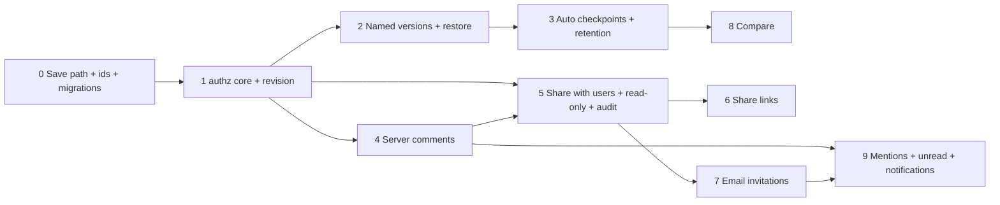

# Delivery plan — vertical slices for Groups B and C

Each slice is independently shippable, deployable, and testable (Jest unit/API tests in `__tests__/`, puppeteer e2e where UI changes). Strict TDD: API tests for every role × endpoint row are written before handlers. Slices 0–1 are prerequisites; after that, B and C tracks can interleave.

| # | Slice | Scope | Done when (acceptance) |
|---|-------|-------|------------------------|
| 0 | **Foundations** | Single PUT per save (remove the duplicate page-level PUT); ids via `crypto.randomUUID()` for new elements/connections/layers/groups/frames; `db/migrations/` + `scripts/migrate.js` + `schema_migrations`; `0001_baseline` replaces `lib/db.js#runMigrations` (Dockerfile/package.json change needs approval). | One network PUT per save; stored content shape = `{elements, connections, layers, groups, viewport}`; migrate is idempotent on a fresh and an existing DB; no new id collisions in a paste-1000 test. |
| 1 | **Authorization core + revision** | `lib/authz/{policy,index,next}.js`; migration `0002` (owner_id backfill, `revision`, `version_seq`, `updated_by`); existing diagram routes wrapped with `withDiagramAuth`; `GET` returns `access` + `revision`; `PUT` honours optional `If-Match`; editor shows conflict dialog on 409. Behaviour-preserving for owners. | Policy unit tests cover full matrix; test fails if any `pages/api/diagrams/**` handler is unwrapped; non-owner gets 404; stale `If-Match` gets 409. |
| 2 | **Named versions + restore** | Migration `0003`; `GET/POST/PATCH /versions`, `GET /versions/{v}`, `POST /restore`; History panel: list, "Name current version", preview (read-only canvas), restore with confirm. | Restore creates `pre_restore` (when needed) + `restore` versions; nothing deleted; audit event written once slice 5's table exists (until then, log line). |
| 3 | **Auto checkpoints + retention** | Server-side throttled `auto` versions in the PUT transaction; content hash dedupe; session-end checkpoint; prune-on-write. | 100 saves in 1 min → ≤ 1 new auto version; identical content never versioned twice; retention test with fake clock. |
| 4 | **Server comments** | Migration `0004`; threads/comments endpoints; `useComments` switches from localStorage to API; element-anchored markers follow elements; detached group; one-time localStorage import (Q-C1). | Threads persist server-side and appear in a second browser session with author identity; delete element → thread detached, restore version → re-attached; body rendered as text. |
| 5 | **Share with existing users + read-only mode + audit** | Migrations `0005` (members table only) + `0006`; `GET /access`, `POST /shares` (existing active users only), member PUT/DELETE; share dialog; "Shared with me" on dashboard; capabilities → `editingPolicy.readOnly`; audit writes; owner audit view; `NOTIFY authz_changed` emitted from the grant repository. | Matrix e2e: viewer can't save (server 403, UI read-only), commenter can comment not edit, editor can edit and see access list, revoke is immediate. |
| 6 | **Share links** | `diagram_links`, `/s/{token}` page, link cookie principal, create/revoke/expiry UI; anonymous view behind `ALLOW_ANONYMOUS_LINKS` (default off). | Revoked/expired link → next request denied; link can't grant editor; token not stored in DB in clear; link cookie scoped to its diagram. |
| 7 | **Email invitations** | `diagram_invitations`; `POST /shares` falls back to invite; accept endpoint + page; resend/revoke; Q-S2 behaviour; uses `lib/email.js`. | Invite bound to email (mismatch → 403); expires at 14 days; accepted invite yields member row and audit events. |
| 8 | **Compare** | `lib/versions/diff.js` (pure); `GET /diff`; History panel "Compare with current" list + canvas highlight overlay. | Diff unit tests: add/remove/change of elements, connections, layers, groups; stable output ordering. |
| 9 | **Mentions, unread, notifications** | `comment_mentions`, `comment_thread_reads`; mention picker limited to people with access; email notifications per Q-C5. | Mentioning a non-member does not grant access; unread counts per user. |
| — | Later | Ownership transfer; trash/soft-delete (Q-M2); admin support access (Q-S1); MCP server + `api_tokens`; Group D per ADR-0004. | — |

Each slice also: appends to `docs/release/IMPLEMENTATION-LOG.md` (create on first slice), updates these architecture docs when the shape deviates, and records REQ status in `docs/requirements/gap-analysis/` if/when that folder exists (it does not today).
