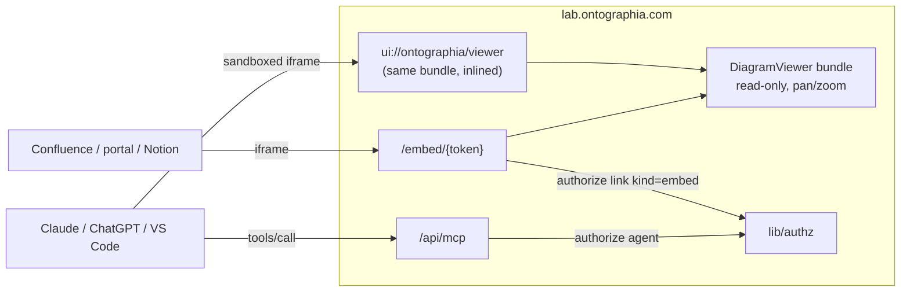
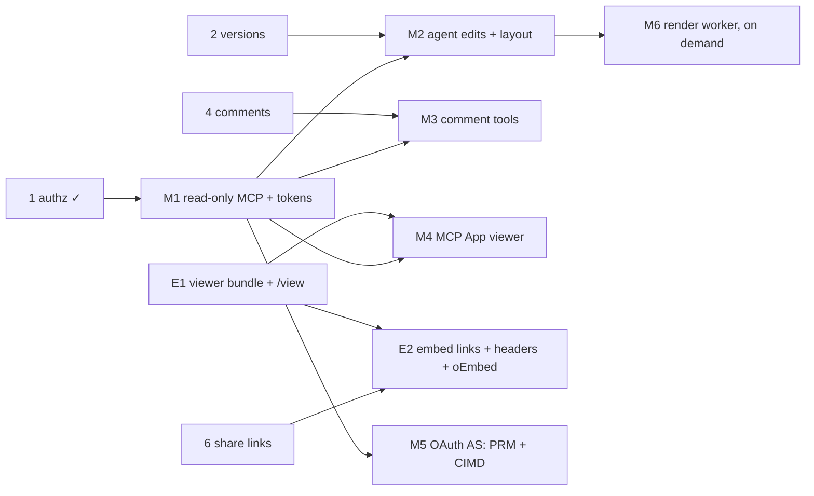

# Investigation — MCP access and embedding of diagrams ("flows")

- Status: **Investigation / proposal** (2026-10-06). Nothing here is built. It refines the agent sketch in [api-contracts.md §6](../api-contracts.md) and the agent principal in [ADR-0003](../adr/0003-sharing-and-permissions.md); it does not change any accepted decision.
- Personas: **AI/MCP Agent** (primary), Solution Architect / CX / PM (they consume diagrams embedded in portals, Notion, Confluence, and ask agents to draft or update them).
- Primitives exposed: agent principal + **API token**, **diagram ops** (add/update/remove elements and connections), **stencil catalog**, **layout**, **projections** (compact JSON, Mermaid, outline), **read-only viewer**, **embed link**.

## 1. Summary and recommendation

- **(A) An MCP server for agents is feasible now** and cheap to start. The current MCP spec (`2026-07-28`) is **stateless**: no handshake, no session, one POST endpoint. That fits a single Next.js API route (`/api/mcp`) in the existing app, with no sidecar and no nginx change. `authorize()` already accepts an `agent` principal with a role cap.
- **The auth surface is what splits the work.** Developer hosts (Claude Code, Cursor, VS Code) accept a **personal access token** in a header. Signing in from claude.ai or ChatGPT needs an **OAuth 2.1 authorization server** (Protected Resource Metadata, Client ID Metadata Documents). next-auth v4 is not an authorization server, so that is a separate, larger slice.
- **(B) Rendering diagrams inside MCP hosts is now standard.** MCP Apps (`io.modelcontextprotocol/ui`) is an official extension, supported by Claude web and Desktop, ChatGPT, VS Code Copilot, M365 Copilot, Cursor, Goose and others. Outside MCP, an `/embed/{token}` iframe works in Confluence, portals and Notion. Both views need the same thing: a **standalone read-only viewer bundle**. That bundle does not exist yet.
- **Build first: slice M1**, a read-only MCP endpoint with API tokens. Tools: list, search, get (as compact JSON, Mermaid or outline), the stencil catalog and the stored thumbnail. Tokens are capped at `commenter` (Q-AI2). Then **M2**, agent edits through `diagram_apply_ops` with `ifRevision` and auto-layout. M2 waits for the versions slice (2) so every agent write has a restore point.
- **Defer:**
  - server-side PNG/SVG rendering (headless Chromium): the stored thumbnail and client-side rendering cover v1;
  - external embeds: need share links (slice 6) and an owner decision, because embeds are anonymous viewing by nature (Q-S6 is "off");
  - the OAuth authorization server;
  - agents managing sharing or embed links (Q-AI1);
  - live co-editing inside a host (Group D).

## 2. Real-world analogy

**A map archive with a reading room and a loans desk.**

- **The reading room (MCP for agents).** A research assistant works under the patron's library card. The card is stamped "may annotate, may not redraw" unless the patron says otherwise (the role cap). The assistant can:
  - ask for any map the patron may see;
  - read the **legend** (the stencil catalog) before drawing;
  - receive either the full sheet (compact JSON) or a **tracing** (Mermaid/outline): quicker to read, but you can't redraw the original from it;
  - draft changes as **instructions to the cartographer** ("add a task after X, connect it to Y") rather than repainting the sheet.

  The archive keeps a copy of the sheet before each batch of changes (a version). Every visit is logged under both names (audit `on_behalf_of`). Notes written on maps by other visitors are _material_, not _orders_: the assistant must not obey a margin note saying "burn the archive" (prompt injection).

- **The loans desk (embedding).** The archive lends a **reproduction under a loan agreement**. The agreement names the venue (origin allowlist / `frame-ancestors`), the term (expiry) and the piece (one diagram, optionally one frame or a pinned version), and the archive can recall it at any time (revoke). The reproduction sits behind glass (read-only, pan/zoom only), so visitors to the venue can't write on the original. A **postcard** (a static PNG/SVG) is cheaper to send but goes stale; a **window** (the live viewer) always shows the current sheet.

What this drives:

- agents use the same doors and keys as people (one `authorize()`), with a lower cap;
- writes are ops against stable ids plus a revision precondition, never whole-blob replacement by an LLM;
- projections are explicitly lossy and read-only;
- embed links are a distinct, venue-bound, view-only kind of share link;
- user-authored text is data, never instruction.

## 3. Options

### 3A. MCP server for agents

| Option                                                                                                                    | How                                                                                                                                       | Effort  | Pros                                                                                                                                                                                              | Cons                                                                                                                                                                        |
| ------------------------------------------------------------------------------------------------------------------------- | ----------------------------------------------------------------------------------------------------------------------------------------- | ------- | ------------------------------------------------------------------------------------------------------------------------------------------------------------------------------------------------- | --------------------------------------------------------------------------------------------------------------------------------------------------------------------------- |
| **A1. Route in the Next app: `pages/api/mcp.js` → `lib/mcp/*` (framework-free), stateless Streamable HTTP (recommended)** | TS SDK v2 `@modelcontextprotocol/server` (server and transport created per request); tools call the repository and `authorize()` directly | **S–M** | Same deploy, DB pool, `lib/authz` and validation; the 2026-07-28 statelessness removes the need for a long-lived process; nginx unchanged except SSE buffering (`X-Accel-Buffering: no` per spec) | Shares the event loop with the editor API: needs rate caps. Older hosts may still speak `2025-11-25` (initialize handshake); verify that the SDK serves both eras before M1 |
| A2. Separate Node process `mcp.lab.ontographia.com`                                                                       | Own process, imports `lib/`                                                                                                               | M       | Isolation, independent scaling and restarts                                                                                                                                                       | Second deploy unit before Group D needs one; duplicates config; `lib/` must stay importable outside Next (it mostly is)                                                     |
| A3. Local stdio server (npm package) calling the REST API with a token                                                    | User runs `npx`; talks to `/api/diagrams`                                                                                                 | S       | No server change                                                                                                                                                                                  | Developer-only, no MCP Apps in web hosts, version skew, publishing/support burden. Not a product surface                                                                    |

Auth options:

| Option                                                         | Hosts it unlocks                                                                                        | Effort | Notes                                                                                                                                                                                                                                                                                                                                                                                                         |
| -------------------------------------------------------------- | ------------------------------------------------------------------------------------------------------- | ------ | ------------------------------------------------------------------------------------------------------------------------------------------------------------------------------------------------------------------------------------------------------------------------------------------------------------------------------------------------------------------------------------------------------------- |
| **Personal access tokens (PAT), `Authorization: Bearer` (v1)** | Claude Code, Cursor, VS Code, Goose, scripts; claude.ai only via the request-header beta (limited orgs) | S      | `api_tokens` table, hashed, prefixed for secret scanning, role cap plus optional diagram allowlist, expiry, revoke, last used. Fits ADR-0003's agent principal unchanged                                                                                                                                                                                                                                      |
| **OAuth 2.1 authorization server (M5)**                        | claude.ai web/Desktop and ChatGPT "connect" buttons, any host per spec                                  | **L**  | Spec: MCP server **MUST** publish Protected Resource Metadata (RFC 9728); clients prefer **Client ID Metadata Documents**; Dynamic Client Registration is deprecated but still used; audience-bound tokens (RFC 8707), PKCE, `iss` validation (RFC 9207). Choice: embed a certified library (e.g. `oidc-provider`) as a small separate process, or a hosted IdP (content stays here; identity data would not) |

Security model (design level):

- **Principal.** `{kind:'agent', userId, tokenId, roleCap, diagramScope?}`. Effective role = `min(user role, roleCap)` (already in `lib/authz/index.js`). Add one rule: if `diagramScope` is set and the diagram is not in it, no role (404). Default cap is `commenter` (Q-AI2), so an editor-capped token is an explicit user choice.
- **Bearer only.** `/api/mcp` ignores the next-auth cookie entirely (no ambient authority, no CSRF), validates `Origin` (spec MUST) and requires `MCP-Protocol-Version`, `Mcp-Method` and `Mcp-Name` to match the body.
- **Rate limits.** `lib/rateLimit.js` per token, with separate read and write buckets. In-memory is fine on one process; it must move with A2 or multi-instance.
- **Writes.** Every write passes the result through `validateDiagramContent` (caps, depth, forbidden keys, URL stripping) plus op-level checks: known stencil type, label length, id format. `ifRevision` is required on writes (409 on mismatch). Writes record `created_via='agent'`, and audit records `actor_type='agent', on_behalf_of=userId` once slice 5's table exists.
- **Prompt injection.** Labels, descriptions, comment bodies and diagram names are untrusted and may be authored by _other_ users once sharing exists.
  - Return them only inside `structuredContent` fields, never in tool descriptions or server instructions.
  - Keep tool descriptions static.
  - Mark tools `readOnlyHint` / `destructiveHint` so hosts ask for confirmation.
  - No delete or sharing tools in v1.
  - Checkpoint before agent writes so any change is one restore away.
  - Tokens scoped to a diagram allowlist bound the blast radius.
- **MCP App iframe.** The host sandboxes it; we still render user text as text, and the app never auto-sends user content via `ui/message`.

### 3B. Embedding the diagrams themselves

| Option                                                              | Where it renders                                     | Effort         | Depends on                  | Notes                                                                                                                                                                                                                                                          |
| ------------------------------------------------------------------- | ---------------------------------------------------- | -------------- | --------------------------- | -------------------------------------------------------------------------------------------------------------------------------------------------------------------------------------------------------------------------------------------------------------- |
| **B1. Standalone read-only viewer bundle (prerequisite for B2–B4)** | Our origin                                           | **M**          | —                           | `DiagramViewer` entry that mounts the canvas with `PROFILE_EMBEDDED_READONLY` (exists in `DiagramProfile.js`) from a content object, without the Next page or editor context. Bundle size (all packs) to watch                                                 |
| **B2. MCP App `ui://ontographia/viewer`**                           | Inside Claude, ChatGPT, VS Code, …                   | S on top of B1 | B1, M1                      | Tool `diagram_show` declares `_meta.ui.resourceUri`; the result's `structuredContent` carries the compact diagram, so the app needs **no network access** (default restrictive CSP is fine; inline the bundle). Hosts without Apps get text + thumbnail + link |
| **B3. `/embed/{token}` iframe**                                     | Confluence iframe macro, portals, Notion embed block | M              | B1, slice 6 links, Q-E1     | Needs header changes (§5). Works for anonymous viewers only: third-party iframes don't get our `SameSite=Lax` session cookie, so signed-in features inside embeds are out of scope                                                                             |
| B4. oEmbed discovery + `/api/oembed`                                | Notion / Iframely previews, CMSs                     | S              | B3                          | Notion embeds via Iframely; rich previews need oEmbed/Iframely recognition                                                                                                                                                                                     |
| B5. Static `/embed/{token}.svg\|.png`                               | Email, wikis without iframes, README                 | **L**          | Server render worker (§4.6) | The only option that does not need JavaScript in the consumer                                                                                                                                                                                                  |
| B6. Web component `<ontographia-diagram>`                           | Our customers' own apps                              | M              | B1, B3                      | It is just a wrapper around the B3 iframe; skip unless asked                                                                                                                                                                                                   |

## 4. Proposed MCP surface v1

Tool names use `snake_case` (portable across hosts that prefix or restrict names). The minimum role is enforced by `authorize()`, never by the tool list. The list is the same for every token; calls beyond the cap return a tool error.

### 4.1 Tools

| Tool                                             | Input (sketch)                                                                                                                             | Output (sketch)                                                                                                                 | Min role / slice                       |
| ------------------------------------------------ | ------------------------------------------------------------------------------------------------------------------------------------------ | ------------------------------------------------------------------------------------------------------------------------------- | -------------------------------------- |
| `diagram_list`                                   | `{scope?:'owned'\|'shared'\|'all', type?, cursor?, limit?≤50}`                                                                             | `{items:[{id, shortId, name, type, updatedAt, role}], nextCursor}` (metadata only)                                              | — / M1                                 |
| `diagram_search`                                 | `{query (1–200), type?, limit?}`                                                                                                           | same as list + `matched:'name'\|'label'\|'description'`                                                                         | — / M1                                 |
| `diagram_get`                                    | `{id, format?:'compact'\|'mermaid'\|'outline', detail?:'full'\|'structure', elementIds?[], frameId?}`                                      | `{diagram:{id,name,type,revision}, content: <format>, truncated?}`                                                              | viewer / M1                            |
| `diagram_thumbnail`                              | `{id}`                                                                                                                                     | MCP `image` content (stored 320 px PNG) or "none yet"                                                                           | viewer / M1                            |
| `catalog_list_packs` / `catalog_get_pack`        | `{}` / `{packId}`                                                                                                                          | packs; stencils `{type, name, description, group, shape, defaultSize, ports[], properties[], isContainer}`; `connectionTypes[]` | — / M1                                 |
| `diagram_create`                                 | `{name, type, ops?:Op[], layout?}`                                                                                                         | `{id, revision, created:{ref→id}}`                                                                                              | (user) / M2                            |
| `diagram_apply_ops`                              | `{id, ifRevision, ops:Op[] (≤200), layout?:{algorithm:'auto'\|'hierarchical'\|'grid'\|'tree', direction?:'LR'\|'TB', scope:'new'\|'ids'}}` | `{revision, created:{ref→id}, warnings[], versionId?}`                                                                          | editor / M2                            |
| `layout_apply`                                   | `{id, ifRevision, elementIds?, algorithm, direction?}`                                                                                     | `{revision, moved:n}`                                                                                                           | editor / M2                            |
| `version_list` / `version_checkpoint`            | `{id}` / `{id, label}`                                                                                                                     | `VersionMeta` (api-contracts §3)                                                                                                | viewer / editor, M2 (after slice 2)    |
| `thread_list` / `thread_create` / `thread_reply` | api-contracts §4 shapes                                                                                                                    | `Thread`                                                                                                                        | viewer / commenter, M3 (after slice 4) |
| `diagram_show`                                   | `{id, frameId?}`                                                                                                                           | text summary + `structuredContent` for the MCP App                                                                              | viewer / M4                            |

`Op` is a small closed union:

```ts
type Op =
  | {
      op: "add_element";
      ref?: string /* '@a' */;
      type: string /* 'process-flow/task' */;
      label?: string;
      x?: number;
      y?: number;
      w?: number;
      h?: number;
      parent?: string /* frame/container id or ref */;
      data?: object;
    }
  | {
      op: "update_element";
      id: string;
      label?;
      x?;
      y?;
      w?;
      h?;
      parent?;
      data?: object; /* merge */
    }
  | {
      op: "remove_element";
      id: string; /* also removes attached connections; M2 only if Q-MCP4 = yes */
    }
  | {
      op: "connect";
      ref?: string;
      from: string;
      to: string /* id or ref */;
      label?: string;
      style?: "straight" | "step" | "curved" | "smart";
      connType?: string;
      fromPort?;
      toPort?;
    }
  | { op: "update_connection"; id: string; label?; style?; connType? }
  | { op: "remove_connection"; id: string };
```

- `ref`s let an agent create and wire a whole flow in one call.
- New ids come from the server's `generateId(prefix)` (`<prefix>-<uuid>`, slice 0) and are returned in `created`.
- The server applies the ops to the current content, then validates the result. A batch is atomic.

### 4.2 Resources and prompts

- **Resources** (for hosts that use them; everything is also reachable through tools, because many hosts only call tools):
  - `ontographia://diagrams/{id}` (compact JSON);
  - `ontographia://diagrams/{id}.mmd` (Mermaid);
  - `ontographia://catalog/{packId}`;
  - `ui://ontographia/viewer` (MCP App HTML, M4).

  List results carry the spec's cache hints (`ttlMs`); catalog entries are cacheable for a release.

- **Prompts: none in v1.** Canned prompts such as "draft a process flow from this spec" are role-specific workflows. The substrate exposes ops + catalog + layout, and the host's own model composes them.

### 4.3 Compact representation (token-efficient, round-trippable, stable ids)

Raw `content` carries editor detail (timestamps, ports, style blobs, `createdAt`, per-element defaults). The compact form keeps what an agent reasons about and omits values equal to the stencil defaults:

```json
{
  "id": "…",
  "name": "Order fulfilment",
  "type": "process-flow",
  "revision": 42,
  "elements": [
    {
      "id": "el-1b9e…",
      "t": "process-flow/start-event",
      "label": "Order received",
      "x": 40,
      "y": 120
    },
    {
      "id": "el-77c0…",
      "t": "process-flow/task",
      "label": "Check stock",
      "x": 160,
      "y": 105,
      "data": { "assignee": "Ops" }
    },
    {
      "id": "frame-3a…",
      "t": "core/frame",
      "label": "Warehouse",
      "x": 0,
      "y": 0,
      "w": 900,
      "h": 400
    }
  ],
  "connections": [
    {
      "id": "conn-9d…",
      "from": "el-1b9e…",
      "to": "el-77c0…",
      "label": "",
      "style": "step"
    }
  ],
  "layers": [{ "id": "layer-…", "name": "Default" }]
}
```

- **Round-trip.** Every compact field maps 1:1 to a content field, so `compact → ops → content` is lossless for what the agent can see. Fields the agent never sees are preserved, because ops patch rather than replace.
- **Ids.** Full ids (no per-response aliases, which would break stability across calls). `detail:'structure'` drops geometry when the agent only needs topology. Token cost vs raw content is to be **measured in M1** (target ≥ 3× smaller on a 100-element flow); no number is claimed here.
- **Text projections** (read-only, lossy, labelled as such):
  - **Mermaid** `flowchart` with stencil → shape mapping (`start-event` → `(( ))`, `decision` → `{ }`, …) and frames as `subgraph`. Readable by any LLM and renderable by many hosts.
  - **Outline**: an indented list by frame/parent with `→` edges, for very large diagrams.

  Mermaid is _not_ accepted as input in v1 (Q-MCP5). It cannot express our stencils, data fields or positions, and Miro has just retired its Mermaid tools in favour of a richer native format.

### 4.4 How agents learn the stencil catalog

- Packs today mix data (`stencils`, `connectionTypes`, `properties`) with React render code (`renderNode`). M1 extracts a **pure catalog module** (data only, no React import) that both the packs and the MCP server consume, with a test that the two stay equal.
- `catalog_get_pack` pages by pack, because 11 packs with hundreds of stencils is too large for one context.
- The `diagram_apply_ops` error for an unknown `type` lists the closest stencil ids.
- `diagram_get` includes the set of packs the diagram uses, so the agent can fetch only those.

### 4.5 Layout when an agent adds elements

LLMs place coordinates badly. Without `x/y`, new elements need server placement:

- `layout:'auto'` (default for elements without coordinates): lay out the _new_ subgraph with `hierarchicalLayout` (direction from the diagram type or the request), then place its bounding box in empty space beside existing content. Reuse the "place in empty space" logic from the templates fix (#19). Existing elements never move unless `layout_apply` names them.
- `LayoutEngine.js` already has `hierarchicalLayout`, `treeLayout`, `gridLayout`, `circularLayout` and `forceDirectedLayout`, but **none is used or tested**. M2 adds tests (determinism, no overlaps, respects `defaultSize`) before exposing them, and they must stay DOM-free.
- Connection paths are computed at render time (the orthogonal router, client-side), so the server stores only endpoints and ports.

### 4.6 Server-side PNG/SVG — needed for v1?

**No.** Today's export captures the live DOM in the browser (`html-to-image`, `jspdf`); packs render HTML/SVG through React.

| Option                                                                                       | Fidelity                                     | Cost                                                                                                                                          |
| -------------------------------------------------------------------------------------------- | -------------------------------------------- | --------------------------------------------------------------------------------------------------------------------------------------------- |
| Stored thumbnail (`diagrams.thumbnail`, 320 px, refreshed by the editor at most every 5 min) | Good enough for "is this the right diagram?" | **Free; use in M1**                                                                                                                           |
| Client rendering in the MCP App / embed (B1)                                                 | Exact                                        | Covered by B1                                                                                                                                 |
| Headless Chromium worker loading a token-gated `/render/{id}` and reusing `exportRenderer`   | Exact                                        | **L**: ~hundreds of MB RAM per browser on a single server, sandboxing, queue (concurrency 1), timeouts. Separate process (M6), only on demand |
| Pure server SVG renderer                                                                     | Approximate                                  | Re-implements every pack renderer. Not worth it                                                                                               |

## 5. Embedding design



- **Route.** `/embed/{token}` (page). The server hashes the token, looks up `diagram_links` (ADR-0003) with a new `kind='embed'`, and renders the viewer with content inlined (no follow-up API call needed).
- **Strictly a link principal.** The route never reads the session cookie: no ambient authority inside third-party pages.
- **Interaction levels.**
  - L1 (v1): pan, zoom, fit, hover/select to read labels and properties, and an "Open in Ontographia" link.
  - L2 (comment) and L3 (edit) need a signed-in user inside a cross-site iframe (Storage Access API / popup). Deferred.
- **Sizing and theming.**
  - Query flags: `?fit=1` (default), `?frame={frameId}` (embed one frame), `?theme=light|dark|auto`, `?toolbar=0`.
  - Responsive to the iframe size. A `postMessage` height hint for hosts that auto-size.
  - The MCP App variant reads the theme from `hostContext` and reports size with `ui/notifications/size-changed`.
- **Embed link fields.**
  - Role is always `viewer`.
  - `allowed_origins[]` is **required**; host wildcards such as `https://*.atlassian.net` are allowed and `*` is refused.
  - Expiry follows Q-S5. `pinned_version_id` is optional (Q-E2). Revocation takes effect on the next load.
  - Use count and last used, like other links.
- **Headers.** Today `next.config.js` sends `X-Frame-Options: SAMEORIGIN` on `/:path*`.
  - Exclude `/embed/:path*` from the global header rule.
  - Add `Content-Security-Policy: frame-ancestors 'self'` app-wide, the modern equivalent, kept alongside XFO.
  - On `/embed/*`, set `frame-ancestors <the token's origins>` **per response** in `getServerSideProps`, because it depends on the token, plus a strict `script-src 'self'`, `Referrer-Policy: no-referrer` (so the token doesn't leak through Referer) and `Cache-Control: private, no-store`.
  - If XFO were left on, browsers would block the frame regardless of what Confluence allows.
- **Risks.**
  - Clickjacking is limited because the embed has no state-changing actions.
  - Anyone who can see the host page can see the diagram: the owner must understand that embedding is publishing to that venue.
  - Token leakage via page source: mitigate with origins + expiry + revoke.
  - DoS: per-token rate limit.
  - Stored XSS from labels would now run in more contexts: same text-only rendering and URL sanitizer.
- **Relation to ADR-0003 / Q-S6.**
  - An embed link is anonymous viewing by definition, and Q-S6 keeps anonymous links **off**. So embeds need their own explicit switch (Q-E1) and should not reuse `requiresSignIn=false`.
  - Agents may not create embed links in v1 (Q-AI1). Lucid exposes `create_embed` tools, but our sharing rule wins.

## 6. Delivery slices (after the current plan; M1 can start once slice 1 is in, which it is)



| #      | Slice                          | Scope                                                                                                                                                                                                                                                                                                                                                                                          | Done when                                                                                                                                                                                                                                                                                                      |
| ------ | ------------------------------ | ---------------------------------------------------------------------------------------------------------------------------------------------------------------------------------------------------------------------------------------------------------------------------------------------------------------------------------------------------------------------------------------------- | -------------------------------------------------------------------------------------------------------------------------------------------------------------------------------------------------------------------------------------------------------------------------------------------------------------- |
| **M1** | **Read-only MCP + API tokens** | `api_tokens` migration; Account page "API tokens" (create shows the secret once, cap viewer/commenter, optional diagram allowlist, expiry, revoke); `lib/authz` `diagramScope` rule; `/api/mcp` (stateless Streamable HTTP, Origin and header checks, bearer only); tools `diagram_list/search/get/thumbnail`, `catalog_*`; pure catalog module; `lib/projection/{compact,mermaid,outline}.js` | Claude Code connects with a PAT and reads a diagram in all 3 formats; revoked or expired token → 401 on the next call; diagram outside scope or not owned → not found; writes impossible; tokens stored hashed; rate limit → 429; compact size measured and recorded; projection unit tests on every pack type |
| **M2** | **Agent edits**                | `diagram_create`, `diagram_apply_ops`, `layout_apply`, `version_*`; atomic ops applier (pure) + validation reuse; required `ifRevision`; auto-checkpoint version before the first agent write per call batch; tested `LayoutEngine`                                                                                                                                                            | A spec-to-flow run creates a laid-out, connected diagram with no overlaps; stale revision → 409 with no partial write; a viewer/commenter-capped token is refused; restoring the pre-agent version undoes the batch; `created_via='agent'` recorded                                                            |
| **M3** | Comment tools                  | `thread_list/create/reply/set_status` over slice 4's repository                                                                                                                                                                                                                                                                                                                                | An agent comment appears in the web UI as "via agent" on behalf of the user; commenter cap honoured                                                                                                                                                                                                            |
| **E1** | Viewer bundle                  | `DiagramViewer` (read-only, content in → pixels out, no editor context); `/view/{id}` same-origin read-only page (also useful for slice 5 viewers)                                                                                                                                                                                                                                             | Renders every pack's sample diagram identically to the editor (visual e2e); bundle size budget recorded                                                                                                                                                                                                        |
| **M4** | MCP App                        | `ui://ontographia/viewer` (inlined E1 bundle), `diagram_show` with `_meta.ui.resourceUri`; text + thumbnail fallback                                                                                                                                                                                                                                                                           | Renders in Claude and in one other host (VS Code or ChatGPT) with no external network; theme follows the host; the fallback text works in a host without Apps                                                                                                                                                  |
| **E2** | Embed links                    | `diagram_links.kind='embed'`, `allowed_origins`, optional pinned version; `/embed/{token}`; header changes (§5); `/api/oembed` + discovery link; share dialog "Embed" tab with copyable `<iframe>`                                                                                                                                                                                             | Frames in an allowed origin and is refused by any other origin (browser test); revoke → next load 410; no session cookie read; XFO absent only on `/embed/*`; Confluence iframe macro manual check                                                                                                             |
| **M5** | OAuth AS                       | PRM at `/.well-known/oauth-protected-resource`, AS metadata, CIMD (+ DCR fallback), PKCE, audience-bound tokens, consent screen showing the role cap                                                                                                                                                                                                                                           | claude.ai custom connector "Use Claude's published identity" connects; token for another resource is rejected; consent-chosen cap enforced                                                                                                                                                                     |
| M6     | Render worker                  | Headless Chromium process, queue, `/render/{id}` with a one-time ticket; `diagram_export({format:'png'\|'svg'})`; static embed images                                                                                                                                                                                                                                                          | Only if usage asks for it                                                                                                                                                                                                                                                                                      |

Each slice follows the repo rules: TDD, append to `docs/release/IMPLEMENTATION-LOG.md`, and update `api-contracts.md` §6 and `data-model.md` when it lands.

## 7. Open questions for the owner (each with a recommended default)

| ID     | Question                                                                   | Recommended default                                                                                                |
| ------ | -------------------------------------------------------------------------- | ------------------------------------------------------------------------------------------------------------------ |
| Q-MCP0 | "Flows" means process-flow diagrams only, or any diagram?                  | **Any diagram type**: the surface is generic (substrate); process flow is just one pack in the catalog             |
| Q-MCP1 | Which hosts matter first?                                                  | **Developer hosts via PAT (M1–M2)**; claude.ai/ChatGPT sign-in (M5) once agent use is proven                       |
| Q-MCP2 | May users mint **editor**-capped tokens, and must those be diagram-scoped? | Yes, by explicit choice; an editor cap **requires** a diagram allowlist in v1 (smaller blast radius for injection) |
| Q-MCP3 | May agents create new diagrams?                                            | Yes, owned by the token's user, `created_via='agent'`, same caps                                                   |
| Q-MCP4 | May agents remove elements or delete diagrams?                             | Remove elements/connections: yes (editor, inside a checkpointed batch). Delete diagrams: **no** in v1              |
| Q-MCP5 | Accept Mermaid as _input_ ("import this flowchart")?                       | **No** in v1; ops + auto-layout only; revisit after M2 usage                                                       |
| Q-MCP6 | Is server-side PNG/SVG export needed?                                      | **No** for v1; thumbnail + client rendering; M6 on demand                                                          |
| Q-MCP7 | Tier gating or quotas for MCP?                                             | No tier gating; global caps (e.g. 120 reads/min, 30 writes/min per token)                                          |
| Q-E1   | Allow external embeds at all, given Q-S6 (anonymous off)?                  | **Separate instance switch, off at launch**; when on, per-link origin allowlist is mandatory and `*` is refused    |
| Q-E2   | Embed shows the live diagram or a pinned version?                          | **Live head** by default; optional pin to a named version                                                          |
| Q-E3   | Show a footer "Open in Ontographia" link in embeds?                        | Yes, small, opens a new tab; it only helps signed-in viewers who have access                                       |
| Q-E4   | Should agents (MCP) be able to create embed or share links?                | **No** (consistent with Q-AI1)                                                                                     |

## Sources (accessed 2026-10-06)

- MCP versioning, current revision **2026-07-28**: <https://modelcontextprotocol.io/specification/versioning>
- 2026-07-28 release post (stateless core, `server/discover`, MRTR, CIMD over DCR, tasks as extension), published 2026-07-28: <https://blog.modelcontextprotocol.io/posts/2026-07-28/>
- Streamable HTTP (2026-07-28): single POST endpoint, no sessions/GET stream, Origin validation, `X-Accel-Buffering`: <https://modelcontextprotocol.io/specification/2026-07-28/basic/transports/streamable-http>
- Authorization (2026-07-28): OAuth 2.1, RFC 9728 PRM (MUST), CIMD (SHOULD), DCR deprecated, RFC 8707, RFC 9207: <https://modelcontextprotocol.io/specification/2026-07-28/basic/authorization>
- MCP Apps overview and client support: <https://modelcontextprotocol.io/extensions/apps/overview>; extension support matrix (Claude web/Desktop, ChatGPT, VS Code Copilot, M365 Copilot, Cursor, Goose, Postman, …): <https://modelcontextprotocol.io/extensions/client-matrix>
- MCP Apps spec 2026-01-26 (`_meta.ui.resourceUri`, `visibility`, `csp`, `ui/*` messages, display modes): <https://github.com/modelcontextprotocol/ext-apps/blob/main/specification/2026-01-26/apps.mdx>; launch coverage 2026-01-26: <https://www.theregister.com/2026/01/26/claude_mcp_apps_arrives/>
- TS SDK v2 (split packages, stateless per-request server): <https://blog.modelcontextprotocol.io/posts/sdk-betas-2026-07-28/>, <https://github.com/modelcontextprotocol/typescript-sdk/releases/tag/v2.3.0>
- Claude custom connectors (OAuth via CIMD/DCR/own client; request-header auth in limited beta): <https://claude.com/docs/connectors/custom/remote-mcp>
- Comparable tools:
  - Miro MCP tools (`canvas_read_as_svg`, `canvas_update_from_svg`, Mermaid tools retired; page updated 2026-09-17): <https://developers.miro.com/docs/miro-mcp-tools>
  - Figma MCP `generate_diagram` (Mermaid → FigJam): <https://developers.figma.com/docs/figma-mcp-server/tools-and-prompts/>
  - Excalidraw MCP App (`read_me`, `create_view`, checkpoints): <https://github.com/excalidraw/excalidraw-mcp>
  - tldraw MCP App (create/edit/delete shapes on an interactive canvas): <https://tldraw.dev/blog/tldraw-mcp-app>
  - Lucid MCP server (create-from-specification, export PNG, `create_embed`; released 2026-03-19, tool list per directory listing): <https://www.pulsemcp.com/servers/lucidsoftware>, <https://help.lucid.co/hc/en-us/articles/42578801807508-Integrate-Lucid-with-AI-tools-using-the-Lucid-MCP-server>
- Embedding targets: Notion embeds via Iframely: <https://www.notion.com/help/embed-and-connect-other-apps>; Confluence iframe macro and XFO blocking: <https://support.atlassian.com/confluence/kb/how-to-put-an-iframe-into-confluence/>
